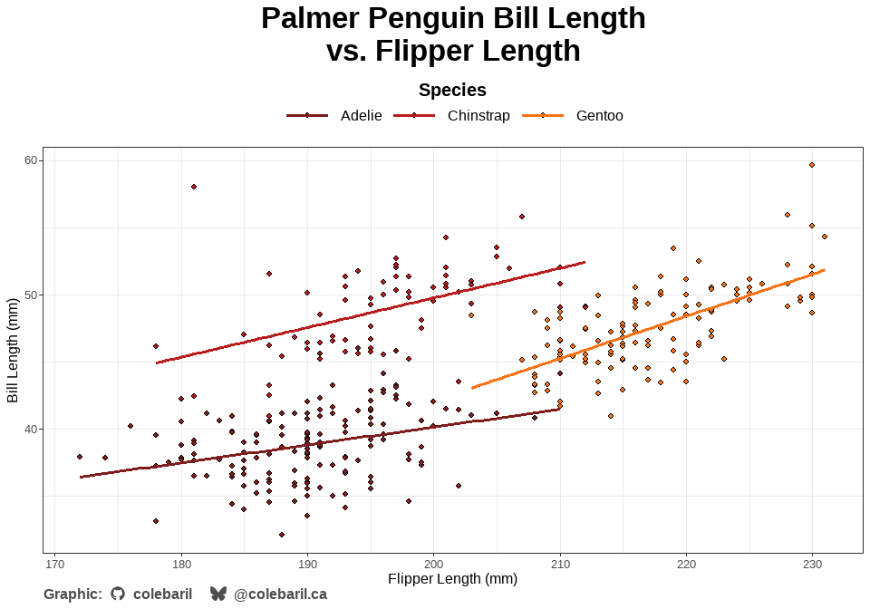

# cwb

The `cwb` package is a personal library of functions, ggplot2 themes,
and palettes that I reach for often in data analysis and visualization.
Instead of re-writing code across projects, I can now use my favorite
utilities directly from this package.

## Installation

You can install the development version of cwb from
[GitHub](https://github.com/) with:

``` r
devtools::install_github("colebaril/cwb")
```

## Example

### Themes and Palettes

In the following example, `theme_parchment()` is used to alter thematic
elements of the plot and `scale_spellbook()` is used to apply my custom
colour palettes. I also use the
[`add_caption_cwb()`](reference/add_caption_cwb.md) function to
automatically insert a caption that is pre-formatted with icons and
social media tags.

``` r
require(pacman)
p_load(cwb, ggplot2, palmerpenguins, extrafont)


ggplot(penguins, aes(flipper_length_mm, bill_length_mm, fill = species, group = species)) +
  geom_point(shape = 21) +
  geom_smooth(aes(colour = species), se = FALSE, method = "lm") +
  scale_cwb(name = "Species", palette = "arcane_flame", type = "d", aesthetics = "fill") +
  scale_cwb(name = "Species", palette = "arcane_flame", type = "d", aesthetics = "colour") +
  theme_parchment() +
  labs(title = "Palmer Penguin Bill Length \nvs. Flipper Length", x = "Flipper Length (mm)", y = "Bill Length (mm)") +
  add_caption_cwb(type = "plot") 
```



### Data Cleaning

In this example, [`clean_data()`](reference/clean_data.md) is used to
standardize column names, trim white space, convert empty columns to
true `NA`s, and flags outliers for any numeric columns using robust
means.

``` r
df <- tibble::tibble(
  "First Name" = c(" Alice ", "Bob", "", "CHARLIE", "dave", "Eve", NA, "Bob", "Bob"),
  "Last Name" = c("Smith", "Jones", "O'Neil", "Brown", "Miller", "O'Brien", "", "Jones", "Jones"),
  "Score" = c(10, 5000, 15, 20, 12, -999, 14, 5000, 5000),  
  "Enrollment Date" = c("2025-01-01", "20241215", "2025/02/01", "", NA, "01-03-2025", "2025-01-01", "2024-12-15", "2024-12-15"),
  "Grade" = c("A", "b", "C", "A", "B", "", "A", "b", "b"),
  "Comments!" = c("Good", " Excellent ", "", "Needs work", NA, "Good!", "Average", " Excellent ", " Excellent "),
  "EmptyCol" = c(NA, NA, NA, NA, NA, NA, NA, NA, NA)
)

print(df)
#> # A tibble: 9 × 7
#>   `First Name` `Last Name` Score `Enrollment Date` Grade `Comments!`   EmptyCol
#>   <chr>        <chr>       <dbl> <chr>             <chr> <chr>         <lgl>   
#> 1 " Alice "    "Smith"        10 "2025-01-01"      "A"   "Good"        NA      
#> 2 "Bob"        "Jones"      5000 "20241215"        "b"   " Excellent " NA      
#> 3 ""           "O'Neil"       15 "2025/02/01"      "C"   ""            NA      
#> 4 "CHARLIE"    "Brown"        20 ""                "A"   "Needs work"  NA      
#> 5 "dave"       "Miller"       12  <NA>             "B"    <NA>         NA      
#> 6 "Eve"        "O'Brien"    -999 "01-03-2025"      ""    "Good!"       NA      
#> 7  <NA>        ""             14 "2025-01-01"      "A"   "Average"     NA      
#> 8 "Bob"        "Jones"      5000 "2024-12-15"      "b"   " Excellent " NA      
#> 9 "Bob"        "Jones"      5000 "2024-12-15"      "b"   " Excellent " NA

clean_data(df, trim_chars = TRUE, empty_to_na = TRUE, flag_outliers = TRUE)
#> # A tibble: 8 × 8
#>   first_name last_name score enrollment_date grade comments   empty_col
#>   <chr>      <chr>     <dbl> <chr>           <chr> <chr>      <lgl>    
#> 1 Alice      Smith        10 2025-01-01      A     Good       NA       
#> 2 Bob        Jones      5000 20241215        b     Excellent  NA       
#> 3 <NA>       O'Neil       15 2025/02/01      C     <NA>       NA       
#> 4 CHARLIE    Brown        20 <NA>            A     Needs work NA       
#> 5 dave       Miller       12 <NA>            B     <NA>       NA       
#> 6 Eve        O'Brien    -999 01-03-2025      <NA>  Good!      NA       
#> 7 <NA>       <NA>         14 2025-01-01      A     Average    NA       
#> 8 Bob        Jones      5000 2024-12-15      b     Excellent  NA       
#> # ℹ 1 more variable: score_outlier_flag <lgl>
```

### Citing Packages

Using the [`cwb::cite_packages()`](reference/cite_packages.md) function,
you can easily cite all packages used in your script or file, choosing
between R Markdown output or plain text options.

``` r
cite_packages(format = "rmd")
```

1.  Chang W (2025). *extrafont: Tools for Using Fonts*.
    <doi:10.32614/CRAN.package.extrafont>
    <https://doi.org/10.32614/CRAN.package.extrafont>, R package version
    0.20, <https://CRAN.R-project.org/package=extrafont>.

2.  Horst AM, Hill AP, Gorman KB (2020). *palmerpenguins: Palmer
    Archipelago (Antarctica) penguin data*. <doi:10.5281/zenodo.3960218>
    <https://doi.org/10.5281/zenodo.3960218>, R package version 0.1.0,
    <https://allisonhorst.github.io/palmerpenguins/>.

3.  Wickham H (2016). *ggplot2: Elegant Graphics for Data Analysis*.
    Springer-Verlag New York. ISBN 978-3-319-24277-4,
    <https://ggplot2.tidyverse.org>.

4.  Baril C (2026). *cwb: Cole’s personal collection of R functions,
    themes, and palettes.*. R package version 0.0.1, commit
    ffecb414d07b613a3508aa2a80eeea1054799859,
    <https://github.com/colebaril/cwb>.

5.  Rinker TW, Kurkiewicz D (2018). *pacman: Package Management for R*.
    version 0.5.0, <http://github.com/trinker/pacman>.
